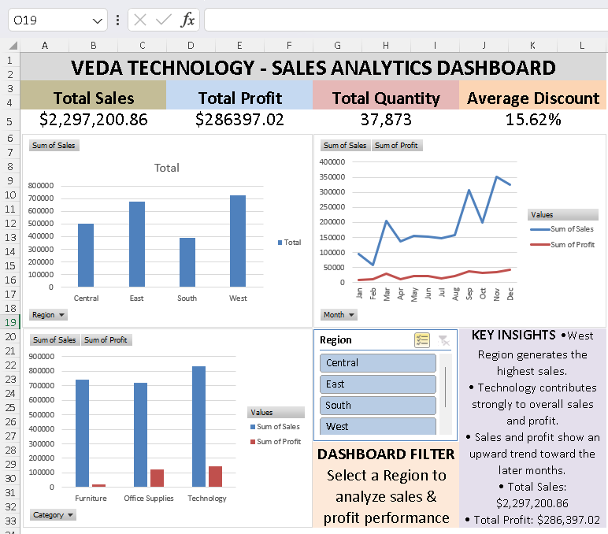

# VEDA Technology - Sales Analytics Dashboard

## 📊 Project Overview

This project is a Sales Analytics Dashboard developed using Microsoft Excel as part of my Data Analytics Internship at VEDA Technology.

The dashboard provides an interactive view of sales and profit performance across different regions, product categories, and months.

## 🎯 Objectives

- Analyze overall sales and profit performance
- Compare regional sales performance
- Analyze monthly sales and profit trends
- Compare sales and profit across product categories
- Provide interactive region-based analysis
- Present key business insights through a professional dashboard

## 🛠️ Tools & Technologies

- Microsoft Excel
- Pivot Tables
- Pivot Charts
- Slicers
- Data Visualization
- Business Analytics

## 📈 Dashboard KPIs

| KPI | Value |
|---|---:|
| Total Sales | $2,297,200.86 |
| Total Profit | $286,397.02 |
| Total Quantity | 37,873 |
| Average Discount | 15.62% |

## 📊 Dashboard Features

### 1. Regional Sales Analysis
Compares total sales across Central, East, South, and West regions.

### 2. Monthly Sales & Profit Trend
Shows the monthly movement of sales and profit throughout the year.

### 3. Category Performance
Compares sales and profit across Furniture, Office Supplies, and Technology.

### 4. Interactive Region Filter
The dashboard includes a Region slicer that allows users to filter and analyze regional performance interactively.

### 5. Key Business Insights
The dashboard highlights important observations related to regional sales, category performance, and monthly trends.

## 💡 Key Insights

- West region generates the highest sales among the regions.
- Technology contributes strongly to overall sales and profit.
- Sales and profit show an upward trend toward the later months.

## 🖼️ Dashboard Preview

## 📁 Project Files

- `VEDA Task 3_Sales_Dashboard.xlsx` — Interactive Excel dashboard
- `Dashboard-preview.png` — Dashboard preview image

## 👨‍💻 Author

**Nishant Tyagi**

Data Analytics Intern | Aspiring Data Analyst

---

⭐ If you find this project useful, feel free to explore the repository.
